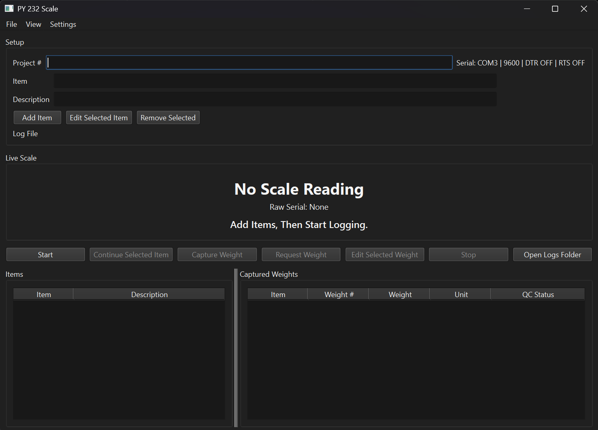

# PY 232 Scale

PY 232 Scale is a Windows desktop app for recording scale readings into a
printable Excel Weight QC Checklist Form. It records up to three weights per
item, marks the lowest reading as `Low`, marks the highest reading as `High`,
and saves the results as `.xlsx` log files.



## Quick Start

For normal use, run the packaged single-file executable:

```text
dist\PY 232 Scale.exe
```

If you are using a zipped package, extract the zip first. Running the folder
package directly from Windows zip preview can cause a `Failed to load Python
DLL` error because Windows may run only the `.exe` without its required support
files.

## Main Features

- Add multiple items and descriptions before weighing.
- Capture three weights for each item.
- Automatically mark the lowest weight as `Low` and the highest weight as
  `High`.
- Save Excel logs in the `Logs` folder.
- Open previously saved logs for editing.
- Continue weighing an item from an existing log.
- Edit item names, descriptions, and incorrect captured weights.
- Print saved logs to an available Windows printer.
- Test COM ports and receive raw scale output from the Settings menu.

## Install From Source

Use these steps if you want to run the Python source code instead of the
packaged app.

1. Install Python 3.12 or newer.
2. Open PowerShell in the project folder.
3. Install the required packages:

```powershell
python -m pip install -r requirements.txt
```

Or double-click:

```text
setup.bat
```

The source dependencies are:

```text
openpyxl
PySide6
pyserial
```

## Run From Source

From the project folder:

```powershell
python main.py
```

Or double-click:

```text
run.bat
```

If the app reports a missing package, run:

```powershell
python -m pip install -r requirements.txt
```

## Basic Workflow

1. Enter the project number.
2. Add each item and description.
3. Open `Settings > Serial Settings` and select the scale COM port.
4. Click `Start`.
5. Place the item on the scale.
6. Wait for the live scale reading to update.
7. Click `Capture Weight`.
8. Repeat until all three weights are captured for the item.
9. Continue through the remaining items.
10. The Excel log is saved automatically in the `Logs` folder.

When all three weights for an item are captured, the app updates the Excel form
and raw data sheet. The lowest reading is marked `Low`, the highest reading is
marked `High`, and the bottom summary fields collect all low and high readings.

## Serial Settings

Open:

```text
Settings > Serial Settings
```

Available settings:

| Setting | Meaning |
| --- | --- |
| Port | The Windows COM port used by the scale, such as `COM4`. |
| Baudrate | The scale communication speed. `9600` is common, but it must match the scale. |
| DTR | Data Terminal Ready. Some USB serial adapters or scales only send data when this signal is on. |
| RTS | Request To Send. Some scales use this as a handshake signal before sending data. |

Only one program can use a COM port at a time. Close receive tests, terminal
programs, or another copy of PY 232 Scale before starting a new scale
connection.

## COM Port And Receive Tests

Use:

```text
Settings > Com Port Test
```

to list available COM ports.

Use:

```text
Settings > Receive Test
```

to probe available ports and show raw scale output. If the test detects scale
data, the app updates the selected GUI port automatically.

The app can parse normal numeric scale lines and ticket-style lines such as:

```text
Net:         0.177kg
```

## Tested Scales

PY 232 Scale has been tested with:

1. UWE SEK-30K Checkweighing Scale
2. Brecknell Digital Counting & Coin Scale B140

## Opening And Editing Saved Logs

Use:

```text
File > Open Log
```

to open a previously saved `.xlsx` log.

After opening a log, you can:

- Double-click item rows to correct item names or descriptions.
- Select an item and click `Edit Selected Item`.
- Select a captured weight and click `Edit Selected Weight`.
- Select an item and click `Continue Selected Item` to capture three new
  weights for that item.
- Use `File > Save Log` to save the current workbook.

Corrected weights automatically rebuild the low and high markings and the
bottom low/high summaries.

## Printing Logs

Use:

```text
File > Print Log
```

The app saves the current workbook, shows available Windows printers, and sends
the `.xlsx` file to the selected printer. Windows must have an application
associated with `.xlsx` files that supports printing, such as Microsoft Excel.

## Output Files

Logs are saved to:

```text
Logs
```

New files are named like:

```text
Weight_QC_Form 1.xlsx
Weight_QC_Form 2.xlsx
Weight_QC_Form 3.xlsx
```

Each workbook includes:

- `QC Form`: the printable checklist form.
- `Raw Data`: timestamped captured readings and raw scale lines.

When running the packaged `.exe`, the `Logs` folder is created beside the
executable. When running from source, the `Logs` folder is created in the
project folder.

## Package A Windows Build

Install build dependencies:

```powershell
python -m pip install -r requirements.txt
python -m pip install -r requirements-build.txt
```

Build the folder package:

```powershell
python -m PyInstaller --clean --noconfirm py232_scale.spec
```

Build the single-file executable:

```powershell
python -m PyInstaller --clean --noconfirm py232_scale_onefile.spec
```

Or build both by double-clicking:

```text
build_exe.bat
```

Build outputs:

```text
dist\PY 232 Scale\PY 232 Scale.exe
dist\PY 232 Scale.exe
```

Recommended distribution file:

```text
dist\PY_232_Scale_OneFile_Windows.zip
```

If you distribute the folder package instead, the whole `PY 232 Scale` folder
must stay together with its `_internal` folder.

## Troubleshooting

### Failed To Load Python DLL

This usually means the folder package was run from inside Windows zip preview.
Click `Extract all` first, or use the single-file executable:

```text
dist\PY 232 Scale.exe
```

### Access Is Denied On COM Port

Another program already has the scale port open. Close other serial tools,
receive tests, terminal programs, or extra copies of the app, then try again.

### No Scale Reading Appears

Check these items:

- Confirm the correct COM port in `Settings > Serial Settings`.
- Run `Settings > Receive Test`.
- Confirm the baudrate matches the scale.
- Try changing DTR or RTS if your scale requires a serial handshake.
- Make sure the scale is sending numeric weight data.

### Capture Weight Is Disabled

Start logging first. The app enables capture controls after a log is started or
an existing log is opened for continuing.

### Print Log Fails

Make sure `.xlsx` files open with Excel or another spreadsheet program that can
print from Windows.

## Project Files

| File | Purpose |
| --- | --- |
| `main.py` | Application entry point. |
| `scale_logger/core.py` | Scale parsing, Excel workbook creation, and log updates. |
| `scale_logger/gui.py` | PySide6 desktop GUI. |
| `requirements.txt` | Runtime Python dependencies. |
| `requirements-build.txt` | PyInstaller build dependency. |
| `py232_scale.spec` | PyInstaller folder-package build. |
| `py232_scale_onefile.spec` | PyInstaller single-file build. |
| `build_exe.bat` | Builds both packaged versions. |
| `weight_qc_checklist_template.xlsx` | Excel checklist template/reference workbook. |
| `THIRD_PARTY_NOTICES.md` | Third party dependency license information. |

## License

PY 232 Scale is licensed under the MIT License. Third party dependency license
information is listed in `THIRD_PARTY_NOTICES.md`.
